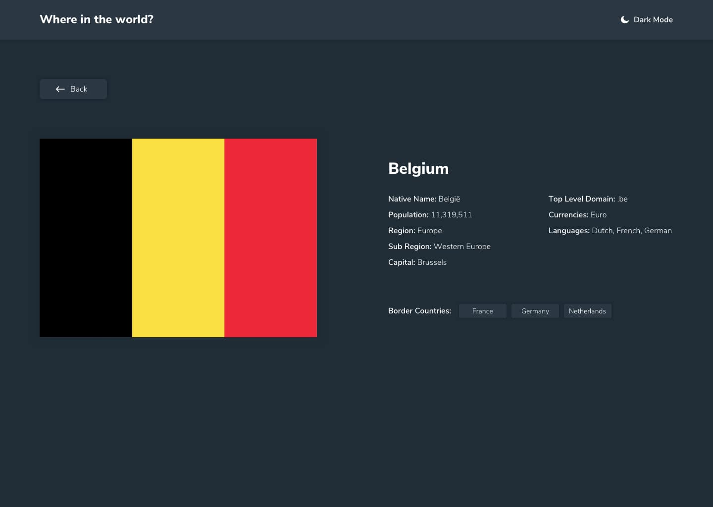
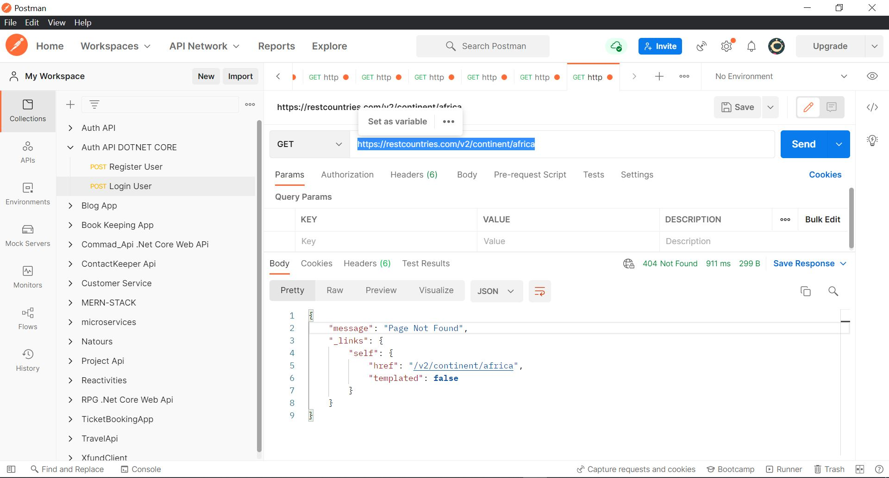

# Countries API using create-react-app

## The challenge

[REST Countries V2 API](https://restcountries.com/#api-endpoints-v2)

users should be able to:

- See all countries from the API on the homepage
- Search for a country using an `input` field
- Filter countries by region [xxx]
- Click on a country to see more detailed information on a separate page
- Click through to the border countries on the detail page
- Toggle the color scheme between light and dark mode
- Web App should be responsive. Desktop and Mobile designs are provided inside the `/design` folder.

## How to run the app

Download the zip file using the green button, or clone the repository by running the command `git clone https://github.com/Nierowheezy/rest-countries.git` in your terminal.
In the same terminal once the command is complete, run `npm install` which will install all the dependencies in the `package.json` file and then run `npm start` which will start your development server on `localhost:3000`.

### You might get an error while performing a filter by region

This api endpoint doesnt work as it returns a error 404 not found https://restcountries.com/v2/continent/{region}
The filter couldn't be implemented except if the api version is changed, but the api v3 works, although it returns a different data

